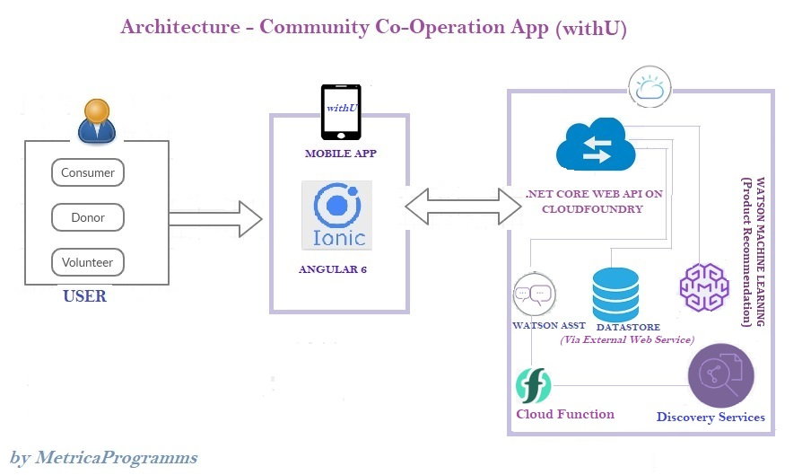
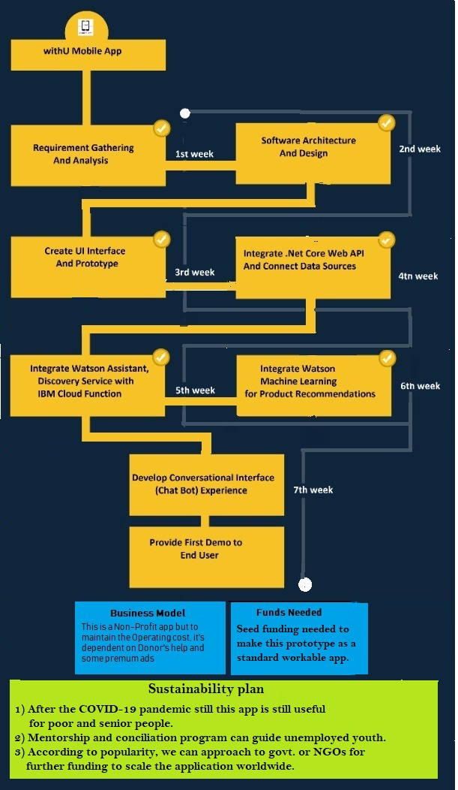

# Call For Code 2020 
withU- Community Co-operation app (by MetricaProgramms)

This is a platform to serve people in many crisis periods like Covid-19 pandemic, natural disaster or maybe helping poor and senior citizens or other emergency services. 
The extended feature can be like adding a Mentorship program to guide people regarding utilization of many govt. facilities or maybe like free doctor consultation using this app during this Covid-19 and any other disaster. 

## The architecture

## Project Roadmap

## Technology Stack

1) .Net core 3.1 web api
2)  Ionic Framework 3 and angular 6
3) 	IBM CloudFoundry(To host .Net core web api)
4)	IBM Machine Learning Services
5)	Watson Assistant
6)	Cloud Function
7)	Watson Discovery Services
8)	Python Notebook

